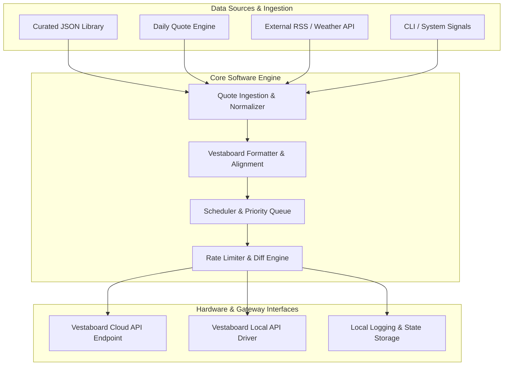

# Vestaboard Non-App Software Architecture & Build Guide

**System Architecture Specification & Technical Build Guide**  
*For Standalone Vestaboard Control Systems, Microservices, and Embedded Integrations*

---

> [!NOTE]
> This guide defines the software architecture, data structures, matrix algorithms, communication protocols, and step-by-step implementation plan for building a robust, headless Vestaboard control service without relying on web application frontends.

---

## 1. System Architecture & High-Level Design

The non-app Vestaboard software base operates as a **headless background microservice / daemon**. It ingests quotes from multiple sources, formats text into Vestaboard's 6x22 character code matrix, schedules message delivery, and dispatches updates via Vestaboard Cloud REST API or Local Network API.



---

## 2. Matrix Data Specifications & Encoding Scheme

### 2.1 Matrix Dimensions
A Vestaboard display consists of **6 rows by 22 columns** (total of 132 split-flaps). The software represents board state as a 2D array of integers `[6][22]`:

$$\text{Board Matrix} \in \mathbb{Z}^{6 \times 22}, \quad \text{where } \text{Matrix}[r][c] \in [0, 70]$$

### 2.2 Official Character & Color Code Map

| Character / Symbol | Character Code | Category |
| :--- | :--- | :--- |
| `Blank (Space)` | `0` | Blank |
| `A - Z` | `1 - 26` | Uppercase Alphabet |
| `1 - 9, 0` | `27 - 36` | Numbers |
| `! @ # $ ( )` | `37 - 42` | Punctuation Group 1 |
| `- + & = ; :` | `44 - 50` | Punctuation Group 2 |
| `' " % , . / ?` | `52 - 60` | Punctuation Group 3 |
| `{red}` | **`63`** | Color Tile (Red) |
| `{orange}` | **`64`** | Color Tile (Orange) |
| `{yellow}` | **`65`** | Color Tile (Yellow) |
| `{green}` | **`66`** | Color Tile (Green) |
| `{blue}` | **`67`** | Color Tile (Blue) |
| `{violet}` | **`68`** | Color Tile (Violet) |
| `{white}` | **`69`** | Color Tile (White) |
| `{black}` | **`70`** | Color Tile (Black) |

---

## 3. Core Software Component Architecture

### Component 1: Matrix Formatter & Auto-Alignment Engine
Converts raw string input and color tokens into a 6x22 matrix array.

```python
# Reference Token Parser & Alignment Logic
class VestaboardFormatter:
    @classmethod
    def format_matrix(cls, raw_text, align="center"):
        # 1. Parse text lines & color tokens ({yellow}, {red})
        # 2. Compute horizontal padding: (22 - line_length) // 2
        # 3. Compute vertical padding: (6 - line_count) // 2
        # 4. Return 6x22 2D array of integer character codes
```

### Component 2: Vestaboard API Gateway
Supports two primary hardware communication paths:

1. **Vestaboard Cloud Read/Write API**:
   - Endpoint: `POST https://rw.vestaboard.com/`
   - Header: `X-Vestaboard-Read-Write-Key: <YOUR_KEY>`
   - Body: JSON array `[[row0], [row1], [row2], [row3], [row4], [row5]]`

2. **Vestaboard Local API (Zero Cloud Latency)**:
   - Endpoint: `POST http://<BOARD_IP>:7000/LocalAPI/message`
   - Header: `X-Vestaboard-Local-Api-Key: <LOCAL_KEY>`
   - Body: JSON array `[[row0], ...]`

---

## 4. Complete Executable Code Base

The repository includes a ready-to-run Python base script in [`vestaboard_core.py`](file:///c:/Users/MadsF/Desktop/Flippboard/vestaboard_core.py).

### Quick Usage Command:
```bash
python vestaboard_core.py
```

### Sample Output Matrix:
```text
Text Input:
{yellow} STAY HUNGRY {yellow}
{red} STAY FOOLISH {red}

Generated 6x22 Character Code Matrix:
 0  0  0  0  0  0  0  0  0  0  0  0  0  0  0  0  0  0  0  0  0  0
 0  0  0  0  0  0  0  0  0  0  0  0  0  0  0  0  0  0  0  0  0  0
 0  0  0 65  0 19 20  1 25  0  8 21 14  7 18 25  0 65  0  0  0  0
 0  0  0 63  0 19 20  1 25  0  6 15 15 12  9 19  8  0 63  0  0  0
 0  0  0  0  0  0  0  0  0  0  0  0  0  0  0  0  0  0  0  0  0  0
 0  0  0  0  0  0  0  0  0  0  0  0  0  0  0  0  0  0  0  0  0  0
```

---

## 5. Step-by-Step Implementation & Build Guide

### Step 1: Environment & Directory Setup
Create your non-app software project structure:
```text
vestaboard-service/
├── vestaboard_core.py      # Core matrix formatter & API client
├── quotes.json             # Quotes dataset
├── config.json             # API keys and board IP configuration
└── service.py              # Background daemon & scheduler
```

### Step 2: Configure API Credentials
Create `config.json`:
```json
{
  "mode": "local",
  "read_write_key": "YOUR_CLOUD_RW_KEY",
  "local_ip": "192.168.1.150",
  "local_key": "YOUR_LOCAL_API_KEY",
  "interval_seconds": 60
}
```

### Step 3: Implement Background Daemon (`service.py`)
```python
import time
from vestaboard_core import VestaboardFormatter, VestaboardApiClient, QuoteSchedulerEngine

def run_service():
    scheduler = QuoteSchedulerEngine()
    client = VestaboardApiClient(read_write_key="YOUR_KEY")
    
    print("Vestaboard Non-App Daemon Started.")
    while True:
        quote = scheduler.get_daily_quote()
        matrix = VestaboardFormatter.format_matrix(quote["text"])
        print(f"Posting quote: {quote['text']}")
        # client.send_matrix_cloud(matrix)
        time.sleep(3600) # Sleep 1 hour

if __name__ == "__main__":
    run_service()
```

### Step 4: Systemd Service Installation (Linux / Raspberry Pi)
Create `/etc/systemd/system/vestaboard.service`:
```ini
[Unit]
Description=Vestaboard Non-App Service
After=network.target

[Service]
ExecStart=/usr/bin/python3 /opt/vestaboard-service/service.py
WorkingDirectory=/opt/vestaboard-service
Restart=always
User=pi

[Install]
WantedBy=multi-user.target
```
Enable service: `sudo systemctl enable --now vestaboard`

---

## Summary Checklist
- [x] Matrix specifications & character encoding scheme defined.
- [x] Auto-centering & color token parsing algorithm implemented in [`vestaboard_core.py`](file:///c:/Users/MadsF/Desktop/Flippboard/vestaboard_core.py).
- [x] Cloud API & Local API client protocols defined.
- [x] Step-by-step system daemon deployment guide documented.
